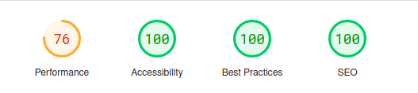
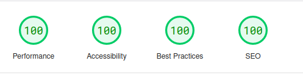

<p align="center">
    <a href="#" target="_blank">
        
    </a>
    <h1 align="center">Andr3sC0des - YouTube Clone</h1>
    <br>
</p>

## About The Project

YouTube Clone is challenge project which tries to reproduce the behavior and apperance of YouTube.

## Features & Pages

- Main Page
  - Reproducable video on image hover
  - Filter by tag
  - Filter by search
  - Scrollable tags
- Video Page
- Shorts Page
  - Scrollable videos
- API
  - Limited videos with own API
- Dark mode and Light mode

## SEO Analytics

### Mobile Analytics 

<a href="https://pagespeed.web.dev/analysis/https-youtube-clone-dun-sigma-vercel-app/zquubgqhzc?form_factor=mobile" target="_blank"></a>

### Desktop Analytics

<a href="https://pagespeed.web.dev/analysis/https-youtube-clone-dun-sigma-vercel-app/zquubgqhzc?form_factor=desktop" target="_blank"></a>


## Preview

If you want to see working demo of the application https://youtube-clone-dun-sigma.vercel.app/

## Getting Started

Install the dependencies:

```sh
$ npm install
// or
$ yarn
```

Run in dev mode:

```sh
$ npm run dev
// or
$ yarn dev
```

## Built With

- JavaScript
- Next.js
- Sass
- CSS Modules

## Screenshots

### Youtube Main Page

