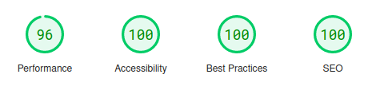
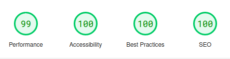
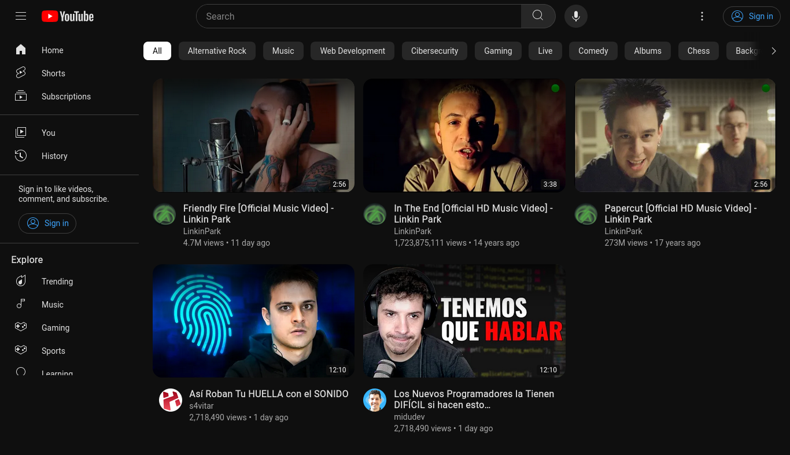

<p align="center">
    <a href="#" target="_blank">
        
    </a>
    <h1 align="center">Andr3sC0des - YouTube Clone</h1>
    <br>
</p>

## About The Project

This YouTube clone is a challenging project aimed at replicating some of the features of the YouTube website.

## Features & Pages

- Main Page
  - Video previews triggered by image hover
  - Filter by tag
  - Filter by search
  - Navigation through scrollable tags
- Video Page
- Shorts Page
  - Browsing with scrollable video content
- API
  - Access a curated selection of videos through our limited API
- Dark Mode and Light Mode
  - Switch between visually comfortable dark and light modes for an enhanced viewing experience

## SEO Analytics

### Mobile Analytics 

<a href="https://pagespeed.web.dev/analysis/https-youtube-clone-dun-sigma-vercel-app/flqgfg4u02?form_factor=mobile"></a>

### Desktop Analytics

<a href="https://pagespeed.web.dev/analysis/https-youtube-clone-dun-sigma-vercel-app/flqgfg4u02?form_factor=desktop"></a>

## Screenshots

### Youtube Main Page



<!-- 
Youtube Mobile Main Page
Shorts utility gif
On Hover utility gif
Dark and light mode gif
-->


## Preview

If you want to see working demo of the application https://youtube-clone-dun-sigma.vercel.app/

## Getting Started

Install the dependencies:

```sh
$ npm install
// or
$ yarn
```

Run in dev mode:

```sh
$ npm run dev
// or
$ yarn dev
```

## 🛠️ Stack

- [![Next.js][next-badge]][next-url] - The full-stack React framework for the web.
- [![Sass][sass-badge]][sass-url] - A utility-first CSS framework for rapidly building custom designs.

[next-url]: https://nextjs.org/
[next-badge]: https://img.shields.io/badge/Next.js-000000?style=for-the-badge&logo=vercel&logoColor=ffffff
[sass-url]: https://sass-lang.com/
[sass-badge]: https://img.shields.io/badge/Sass-bf4080?style=for-the-badge&logo=sass&logoColor=ffffff
